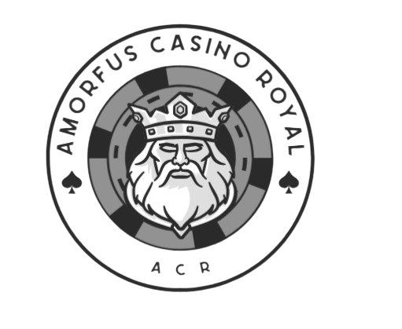
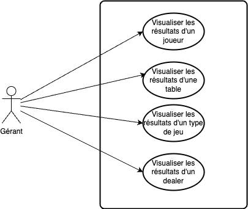
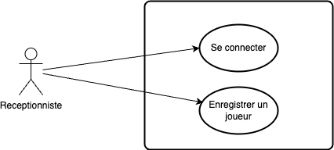
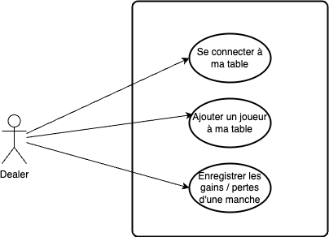

# **Appel d'Offre : Développement d'une Application de Visualisation des Performances pour Gérants de Casino**

## **Introduction** :  

### Présentation de l'Entreprise :

Fondé en 1998, Amorfus Casino Royale s'est rapidement imposé comme l'un des casinos les plus prestigieux et prospères de Monaco. Fort d'une expérience de plus de 25 années dans l'industrie du jeu, notre établissement est reconnu pour son excellence en matière de divertissement, de service à la clientèle et d'intégrité dans toutes ses opérations.

Au fil des années, Amorfus Casino Royale s'est forgé une solide réputation en offrant une expérience de jeu inégalée à ses clients, alliant élégance, confort et sécurité. Notre équipe dévouée de professionnels du jeu s'efforce constamment d'innover et de répondre aux besoins changeants de notre clientèle, tout en préservant les valeurs fondamentales qui font de notre casino un lieu de prédilection pour les amateurs de jeux de hasard.

### Problématique :

Malgré notre succès continu, nous sommes confrontés à un défi majeur : la nécessité de disposer d'outils de gestion avancés pour surveiller et analyser en temps réel les performances de notre casino. Alors que notre clientèle continue de croître et que l'industrie du jeu devient de plus en plus compétitive, il est impératif pour nous de rester à la pointe de l'innovation et de prendre des décisions stratégiques éclairées pour garantir notre succès à long terme.

À cet égard, la capacité de visualiser rapidement et efficacement les gains et pertes générés par nos joueurs, nos tables de jeu et nos différents types de jeux est cruciale. Actuellement, nous manquons d'un outil centralisé qui nous permette d'accéder à ces données de manière cohérente et en temps réel, ce qui limite notre capacité à prendre des décisions éclairées et opportunes pour maximiser nos revenus et optimiser notre offre de jeux.

Afin de relever ce défi et de consolider notre position de leader dans l'industrie du jeu, Amorfus Casino Royale lance cet appel d'offres pour le développement d'une application de visualisation des performances destinée aux gérants de casino. Cette application jouera un rôle essentiel dans notre stratégie globale en nous fournissant les outils nécessaires pour surveiller et analyser efficacement les performances de notre casino, et ainsi continuer à offrir une expérience de jeu exceptionnelle à nos clients.

## **Descriptif du projet :**

### **Fonctionnalités Requises :**

1. **Visualisation des Gains et Pertes Individuelles des Joueurs :**

   - Les gérants doivent pouvoir voir les gains et pertes individuelles des joueurs depuis le début de leur session de jeu.

   - Les montants doivent être présentés de manière claire avec des indications visuelles pour distinguer les gains des pertes.

2. **Visualisation des Gains et Pertes par Table de Jeu :**
   - Une interface doit permettre aux gérants de voir les résultats cumulés de chaque table de jeu en temps réel.

   - Les informations doivent être présentées de manière concise avec la possibilité de filtrer par table de jeu.

3. **Visualisation des Gains et Pertes par Type de Jeu :**
   - Les gérants doivent pouvoir comparer les performances de chaque type de jeu proposé par le casino.

   - Les totaux des gains et des pertes doivent être affichés pour chaque type de jeu pour permettre une analyse comparative.

4. **Graphiques et Statistiques Détaillés :**
   - Des graphiques interactifs doivent être disponibles pour offrir une visualisation approfondie des tendances de gains et pertes au fil du temps.

   - Les gérants doivent pouvoir zoomer, faire défiler et modifier les échelles de temps des graphiques pour obtenir des détails précis.

   - Des statistiques telles que la moyenne des gains par table, le pourcentage de gain par type de jeu, etc., doivent être fournies pour aider les gérants dans leur analyse.
	

5. **Enregistrement des joueurs dans le système :**

	- L'application doit permettre l'enregistrement des joueurs dans le système dès leur arrivée au casino et l'obtention de jetons, en saisissant leurs informations de base telles que leur nom, leur date de naissance, leur adresse email (le cas échéant), etc.
	
	- Les informations enregistrées doivent être accessibles aux gérants à tout moment pour permettre une gestion efficace des comptes des joueurs et une analyse précise de leurs performances de jeu.

	

6. **Alimentation du système par les croupiers :**

	- Les croupiers doivent avoir la possibilité d'alimenter le système en données à la fin de chaque manche ou session de jeu, y compris les gains et pertes des joueurs, les montants misés, les résultats des paris, etc.
	
	- Les informations saisies par les dealers doivent être automatiquement intégrées dans le système en temps réel, permettant aux gérants d'accéder à des données actualisées instantanément.

	- Des fonctionnalités de vérification et de validation doivent être intégrées pour garantir l'exactitude et l'intégrité des données saisies par les dealers.

	

### **Maquette :**

Une maquette figma de l'application est disponible à des fins de référence et de visualisation à l'adresse suivante : [https://www.figma.com/design/GdHX9VFth5vWGSdBstr93c](https://www.figma.com/design/GdHX9VFth5vWGSdBstr93c).

Les prestataires sont encouragés à examiner attentivement la maquette existante et à proposer des améliorations significatives qui pourraient optimiser l'expérience utilisateur et renforcer l'esthétique globale de l'application. 

Des suggestions pourraient inclure des ajustements de mise en page, des modifications de l'interface utilisateur pour une meilleure ergonomie, des améliorations de la lisibilité des données, ou encore des propositions pour une utilisation plus efficace de l'espace visuel.

Nous attendons avec intérêt vos suggestions et vos idées pour optimiser le design de l'application et nous aider à fournir une expérience utilisateur exceptionnelle pour les gérants de casino d'Amorfus Casino Royal.

### **Exigences Techniques :**

- L'application doit être développée pour être accessible depuis des ordinateurs de bureau et des appareils mobiles.

- Elle doit être compatible avec les principaux navigateurs web et systèmes d'exploitation.

- La sécurité des données des joueurs et du casino doit être une priorité absolue.

- L'application doit être rapide, fiable et offrir des performances optimales même en cas de charges élevées.

### **Livraisons Attendues :**

- Une version fonctionnelle de l'application répondant aux fonctionnalités requises.

- Documentation détaillée comprenant les instructions d'utilisation et de maintenance.

- Un plan de formation pour le personnel du casino sur l'utilisation de l'application.

## **Échéancier et Budget :**

- L'échéancier pour le développement de l'application est de 6 mois à partir de la date de sélection du prestataire.

- Le budget alloué pour ce projet est de 200 000 €.

## **Procédure de Soumission :**

Les prestataires intéressés doivent soumettre leur proposition avant la date limite du 15 Mai 2024 à l'adresse `contact@acr.com`. Les propositions doivent inclure une description détaillée de la méthodologie proposée, un calendrier de mise en œuvre, des références clients pertinentes, ainsi qu'une proposition financière détaillée.

Amorfus Casino Royale se réserve le droit de sélectionner le prestataire en fonction de la pertinence de la proposition par rapport aux besoins spécifiques du projet, de l'expérience passée du prestataire dans le développement d'applications similaires, et du coût global du projet.

## **Contact :**

Pour toute question ou clarification concernant cet appel d'offres, veuillez contacter `contact@acr.com`.

Nous attendons avec impatience vos propositions.

Cordialement,

Amorfus Casino Royale